# PropManage SaaS — Entity Relationship Diagram

> **Note:** This diagram shows table names, primary keys, composite keys and key foreign-key relationships.
> Sensitive column details (pricing tiers, internal payloads) are intentionally omitted here.
> Review the actual migration files for full column definitions.

---

## Citus Table Classification

| Classification | Tables |
|---|---|
| **Local (central)** | `saas_clients`, `domains`, `saas_client_users`, `plans`, `subscriptions`, `subscription_payments`, `system_admins`, `migrations`, `jobs`, `failed_jobs` (pre-distribution) |
| **Reference (global lookup)** | `ref_property_types`, `ref_unit_types`, `ref_payment_types`, `ref_billing_types`, `ref_tenancy_agreement_types`, `ref_utilities`, `services` |
| **Distributed (tenant-scoped)** | All tables below with `saas_client_id` distribution column |

---

## ERD — Mermaid Format

```mermaid
erDiagram

    %% ──────────────────────────────────────────
    %% CENTRAL / LOCAL TABLES
    %% ──────────────────────────────────────────

    saas_clients {
        uuid id PK
        string name
        string slug
        int plan_id FK
        string status
        string email
        boolean is_suspended
        timestamp suspended_at
        timestamp trial_ends_at
        timestamp created_at
        timestamp updated_at
    }

    plans {
        int id PK
        string name
        string slug
        decimal price
        string billing_cycle
        int trial_days
        int max_properties
        decimal overage_price_per_property
        string currency
        timestamp created_at
        timestamp updated_at
    }

    subscriptions {
        int id PK
        uuid saas_client_id FK
        int plan_id FK
        string status
        timestamp current_period_start
        timestamp current_period_end
        timestamp trial_ends_at
        timestamp grace_period_ends_at
        timestamp cancellation_date
        int renewal_attempts
        timestamp created_at
        timestamp updated_at
    }

    subscription_payments {
        int id PK
        uuid saas_client_id FK
        int subscription_id FK
        decimal amount
        string currency
        string payment_method
        string status
        string mpesa_ref
        timestamp paid_at
        timestamp failed_at
        string failure_reason
        timestamp created_at
        timestamp updated_at
    }

    saas_client_users {
        int id PK
        uuid saas_client_id FK
        string name
        string email
        string role
        timestamp created_at
        timestamp updated_at
    }

    system_admins {
        int id PK
        string name
        string email
        string password
        timestamp created_at
        timestamp updated_at
    }

    domains {
        int id PK
        uuid saas_client_id FK
        string domain
        timestamp created_at
        timestamp updated_at
    }

    %% ──────────────────────────────────────────
    %% REFERENCE TABLES (global lookup — replicated to all shards)
    %% ──────────────────────────────────────────

    ref_property_types {
        int id PK
        string name
        timestamp created_at
        timestamp updated_at
    }

    ref_unit_types {
        int id PK
        string name
        timestamp created_at
        timestamp updated_at
    }

    ref_payment_types {
        int id PK
        string name
        timestamp created_at
        timestamp updated_at
    }

    ref_billing_types {
        int id PK
        string name
        timestamp created_at
        timestamp updated_at
    }

    ref_tenancy_agreement_types {
        int id PK
        string name
        timestamp created_at
        timestamp updated_at
    }

    ref_utilities {
        int id PK
        string name
        timestamp created_at
        timestamp updated_at
    }

    services {
        int id PK
        string name
        timestamp created_at
        timestamp updated_at
    }

    %% ──────────────────────────────────────────
    %% DISTRIBUTED TABLES (tenant-scoped, distributed on saas_client_id)
    %% Composite PK: (id, saas_client_id) on all distributed tables
    %% All FK on distributed tables include saas_client_id on both sides
    %% ──────────────────────────────────────────

    users {
        int id
        uuid saas_client_id
        string name
        string email
        string password
        timestamp created_at
        timestamp updated_at
    }

    properties {
        int id
        uuid saas_client_id
        string name
        string address
        int ref_property_type_id FK
        int status
        int archive
        timestamp created_at
        timestamp updated_at
    }

    units {
        int id
        uuid saas_client_id
        int property_id FK
        string unit_number
        int ref_unit_type_id FK
        decimal rent_amount
        int status
        timestamp created_at
        timestamp updated_at
    }

    tenants {
        int id
        uuid saas_client_id
        string name
        string email
        string phone
        timestamp created_at
        timestamp updated_at
    }

    tenancy_agreements {
        int id
        uuid saas_client_id
        int unit_id FK
        int tenant_id FK
        int ref_tenancy_agreement_type_id FK
        date start_date
        date end_date
        decimal rent_amount
        int status
        timestamp created_at
        timestamp updated_at
    }

    invoices {
        int id
        uuid saas_client_id
        int tenancy_agreement_id FK
        decimal amount
        string status
        date due_date
        timestamp created_at
        timestamp updated_at
    }

    invoice_payments {
        int id
        uuid saas_client_id
        int invoice_id FK
        decimal amount
        int ref_payment_type_id FK
        string reference
        timestamp created_at
        timestamp updated_at
    }

    tenancy_bills {
        int id
        uuid saas_client_id
        int tenancy_agreement_id FK
        string description
        decimal amount
        int ref_billing_type_id FK
        timestamp created_at
        timestamp updated_at
    }

    meter_readings {
        int id
        uuid saas_client_id
        int unit_id FK
        int ref_utility_id FK
        decimal reading
        date reading_date
        timestamp created_at
        timestamp updated_at
    }

    property_utilities {
        int id
        uuid saas_client_id
        int property_id FK
        int ref_utility_id FK
        timestamp created_at
        timestamp updated_at
    }

    property_services {
        int id
        uuid saas_client_id
        int property_id FK
        int service_id FK
        timestamp created_at
        timestamp updated_at
    }

    property_payment_details {
        int id
        uuid saas_client_id
        int property_id FK
        int ref_payment_type_id FK
        string account_number
        timestamp created_at
        timestamp updated_at
    }

    property_owners {
        int id
        uuid saas_client_id
        int property_id FK
        string name
        string email
        string phone
        timestamp created_at
        timestamp updated_at
    }

    credit_notes {
        int id
        uuid saas_client_id
        int invoice_id FK
        decimal amount
        string reason
        timestamp created_at
        timestamp updated_at
    }

    manual_invoices {
        int id
        uuid saas_client_id
        int tenant_id FK
        decimal amount
        string status
        date due_date
        timestamp created_at
        timestamp updated_at
    }

    manual_invoice_items {
        int id
        uuid saas_client_id
        int manual_invoice_id FK
        string description
        decimal amount
        timestamp created_at
        timestamp updated_at
    }

    sent_emails {
        int id
        uuid saas_client_id
        string to_email
        string subject
        string status
        timestamp sent_at
        timestamp created_at
        timestamp updated_at
    }

    email_attachments {
        int id
        uuid saas_client_id
        int sent_email_id FK
        string file_path
        string file_name
        timestamp created_at
        timestamp updated_at
    }

    vacation_notices {
        int id
        uuid saas_client_id
        int tenancy_agreement_id FK
        date notice_date
        date vacate_date
        string status
        timestamp created_at
        timestamp updated_at
    }

    tenancy_agreement_files {
        int id
        uuid saas_client_id
        int tenancy_agreement_id FK
        string file_path
        string file_name
        timestamp created_at
        timestamp updated_at
    }

    unit_occupation_monthly_records {
        int id
        uuid saas_client_id
        int unit_id FK
        int year
        int month
        boolean is_occupied
        timestamp created_at
        timestamp updated_at
    }

    escalation_rates_and_amounts_logs {
        int id
        uuid saas_client_id
        int tenancy_agreement_id FK
        decimal old_amount
        decimal new_amount
        decimal escalation_rate
        timestamp escalated_at
        timestamp created_at
        timestamp updated_at
    }

    support_tickets {
        int id
        uuid saas_client_id
        string subject
        string description
        string status
        string priority
        timestamp created_at
        timestamp updated_at
    }

    usage_metrics {
        int id
        uuid saas_client_id
        int properties_used
        int units_used
        int tenants_used
        timestamp last_calculated_at
        timestamp created_at
        timestamp updated_at
    }

    %% ──────────────────────────────────────────
    %% RELATIONSHIPS
    %% ──────────────────────────────────────────

    saas_clients ||--o{ domains : "has"
    saas_clients ||--o| subscriptions : "has"
    saas_clients ||--o{ subscription_payments : "has"
    saas_clients ||--o{ saas_client_users : "has"
    saas_clients }o--|| plans : "subscribes to"
    subscriptions }o--|| plans : "based on"
    subscription_payments }o--|| subscriptions : "for"

    properties }o--|| ref_property_types : "typed by"
    units }o--|| properties : "belongs to"
    units }o--|| ref_unit_types : "typed by"
    tenancy_agreements }o--|| units : "for"
    tenancy_agreements }o--|| tenants : "with"
    tenancy_agreements }o--|| ref_tenancy_agreement_types : "typed by"
    invoices }o--|| tenancy_agreements : "for"
    invoice_payments }o--|| invoices : "pays"
    invoice_payments }o--|| ref_payment_types : "via"
    tenancy_bills }o--|| tenancy_agreements : "for"
    tenancy_bills }o--|| ref_billing_types : "typed by"
    meter_readings }o--|| units : "for"
    meter_readings }o--|| ref_utilities : "measures"
    property_utilities }o--|| properties : "for"
    property_utilities }o--|| ref_utilities : "type"
    property_services }o--|| properties : "for"
    property_services }o--|| services : "type"
    property_payment_details }o--|| properties : "for"
    property_payment_details }o--|| ref_payment_types : "via"
    property_owners }o--|| properties : "owns"
    credit_notes }o--|| invoices : "for"
    manual_invoice_items }o--|| manual_invoices : "item of"
    email_attachments }o--|| sent_emails : "attached to"
    vacation_notices }o--|| tenancy_agreements : "for"
    tenancy_agreement_files }o--|| tenancy_agreements : "for"
    unit_occupation_monthly_records }o--|| units : "for"
    escalation_rates_and_amounts_logs }o--|| tenancy_agreements : "for"
    usage_metrics }o--|| saas_clients : "measures"
```



---

## Colocation Verification Query

After running migrations, verify all distributed tables share the same `colocationid`:

```sql
SELECT logicalrelid, colocationid, partmethod
FROM pg_dist_partition
ORDER BY colocationid, logicalrelid;
```

All tenant-scoped distributed tables must share the **same colocationid**.

---

## Distribution Column Notes

- **Distribution column:** `saas_client_id` (UUID) — consistent across all distributed tables.
- **Shard count:** 10 (local dev) — configured in `docker/citus-bootstrap.sh`.
- **Composite PKs:** All distributed tables use `(id, saas_client_id)` composite PKs.
- **Foreign keys:** All FKs on distributed tables include `saas_client_id` on both sides to allow Citus to resolve references within the same shard.
- **Reference tables:** Global lookup tables replicated to all shards — no `saas_client_id` needed.
- **Local/central tables:** SaaS management tables (`saas_clients`, `plans`, `subscriptions`) — NOT distributed.
